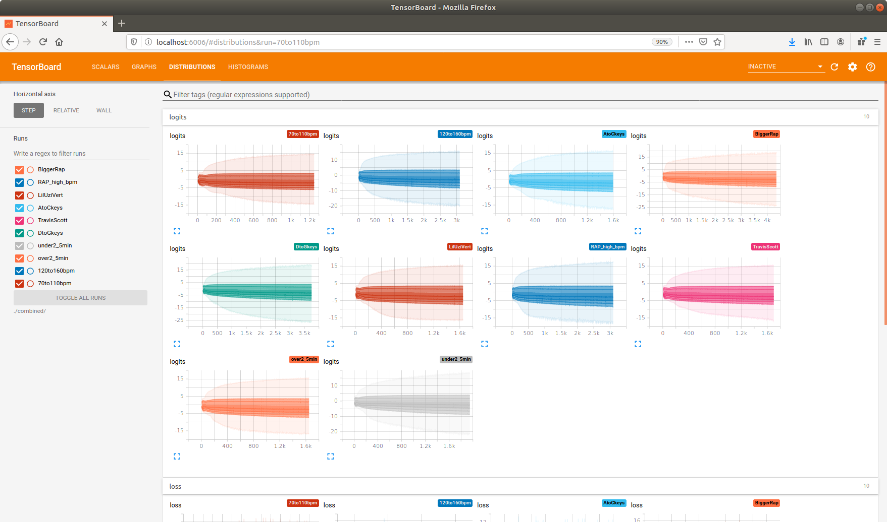

# RNN-Prediction-Rap-Lyrics

Theory: Recurrent Neural Networks
* http://karpathy.github.io/2015/05/21/rnn-effectiveness/

Software and tools list:
* Anaconda python
* Jupyter Notebook
* tensorflow-1.7.0-cp27-cp27mu-manylinux1_x86_64.whl
* https://www.tensorflow.org/text/tutorials/text_generation
* https://github.com/tensorflow/text
* https://github.com/tensorflow/text/blob/master/docs/tutorials/text_generation.ipynb
* 

Data sets used for training and testing:
*
*
* Bible
* Trump's tweets
* bible
* trump_nonum
* LilUziVert
* Linux
* AtoCkeys
* DtoGkeys
* under2_5min
* over2_5min
* 120to160bpm
* 70to110bpm
* BiggerRapLyrics2
* TravisScott

[
